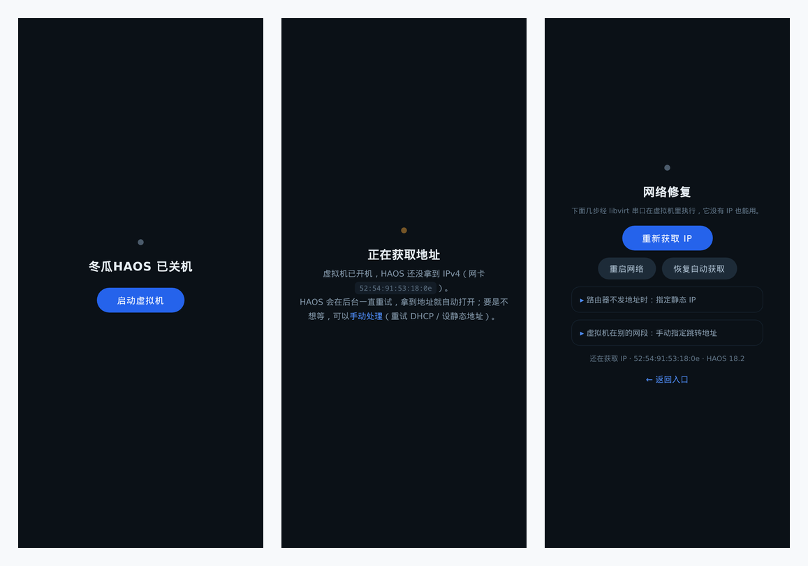

<p align="center">
  <br/>
  <b>冬瓜HAOS for fnOS</b><br/>
  在飞牛 NAS 上把冬瓜HAOS 装成一台虚拟机，Home Assistant 开箱即用，装完只管用一个入口访问<br/><br/>
  <a href="../../releases/latest"></a>
  
  
  <a href="https://www.home-assistant.io/"></a>
</p>

<p align="center">
  <br/>
  <sub>固定入口 <code>:36123</code> 的三种状态 —— 已关机可一键开机 · 启动过程说清卡在哪 · 拿不到 IP 时经串口自救</sub>
</p>

向导里选好版本、CPU、内存、磁盘就全自动跑完：**下载冬瓜官方镜像 → 完整性把关 → 建虚拟机 → 应用中心与桌面双图标直达**。
镜像由 [冬瓜HAOS 官方 CDN](https://bbs.hassbian.com/thread-23791-1-1.html) 原样获取，本仓库只做 fnOS 侧封装，**不改 HAOS 本体**。

---

## 🚀 快速开始

| # | 做什么 | 说明 |
|---|---|---|
| 1 | [下载 FPK](../../releases/latest) | 当前 `18.2.7` · SHA256 `d18f108c83a6b713a6aebeb121d8c86627728af6c441605cd27538ce173503d8` |
| 2 | 应用中心 → 手动安装 | 向导选 HAOS 版本 / CPU / 内存 / 磁盘（磁盘填 `0` = 直通本机空闲整盘） |
| 3 | 等后台跑完 | 提交后**立即返回**；全新安装含下载约 3~6 分钟，磁盘已存在约 10~40 秒 |
| 4 | 打开 `http://<NAS 地址>:36123/` | 应用中心「打开」与桌面两个图标都走这里，自动跟随虚拟机 IP 变化 |

> **要求**：fnOS x86_64 · 已装飞牛「虚拟机」应用（`trim.vm`，需 `/dev/kvm`）· 内存 ≥ 2 GB · 安装卷剩余 ≥ 2 GB
>
> **卡住了**：`cat /tmp/haos-install.state`（`starting → downloading → verifying → extracting → provisioning → resizing → defining-vm → entry-service → ready`，失败为 `failed:xxx`），日志 `/tmp/haos-install.log`
>
> **首次启动慢是正常现象**：Supervisor 首启要从上游拉运行镜像，Web 页面可能需 **15~40 分钟**就绪（之后每次开机约 2~10 分钟），入口页会一路显示进度

## ✨ 会用到的几件事

| 能力 | 说明 |
|---|---|
| **固定入口 + 桌面双图标** | **冬瓜HAOS** → 管理后台 `:8124`，**Home Assistant**（`/ha`）→ `:8123`；六级寻踪链 MAC/ARP → VNC 横幅 OCR → mDNS → domifaddr → 局域网扫描 → 端口探测，DHCP 换址无感跟随 |
| **状态透明** | 分「已关机 / 正在启动 / 还在获取地址 / Web 未就绪 / 已就绪」显示；跳转前要求目标**真正应答 HTTP**，两个门分别把关，不会把浏览器甩到空白页 |
| **反代优化** | `:36124` 透传管理后台并改写前端 UA 检测（低版本号浏览器不再误弹横幅）；面板里「HA 登录页 / TTYD」按钮自动指回虚拟机真实地址 |
| **串口网络修复** | 拿不到 IPv4 时在入口页经 libvirt 串口重新获取地址、重启网络、设静态 IP、手动指定跳转地址，**不依赖虚拟机已有网络** |
| **停用/启用联动** | 停用即发 ACPI 优雅关机（HAOS 逐个停容器，**45~70 秒**落定属正常）；在入口页点开机也会把应用中心状态同步回来 |
| **数据不丢** | 磁盘版本被记录：改选别的版本先把旧盘整块留档，同版本原盘复用；重装沿用同一网卡 MAC 与 UUID，路由器绑定不失效 |
| **秒回安装** | 规避 fnOS 约 190 秒的安装回调看门狗；中断后在应用中心点「启动」按原参数续跑 |

## 🌐 入口与端口

| 地址 | 用途 |
|---|---|
| `http://<NAS>:36123/` | 主入口。就绪后跳管理后台；`/ha` 跳 Home Assistant；`/net` 是网络修复页 |
| `http://<NAS>:36124/` | 管理后台反代（去横幅 + 按钮改写）。直连 `VM_IP:8124` 也可用，但没有这些改写 |

> 跨网段提醒：`36123/36124` 只要到得了 NAS 就能用；而 `/ha` 和面板里的「HA 登录页 / TTYD」是**浏览器直连虚拟机 IP**，跨网段、VPN 之外或 AP 隔离时会打不开。

## 📦 支持的系统版本

镜像取自 [`fw.wghaos.com/haos/x86-64-vm/`](https://fw.wghaos.com/haos/x86-64-vm/)，安装时按**精确字节数 + xz CRC + qcow2 魔数**三重把关，不过就整包重下。

| 向导选项 | 大小 | 验证情况 |
|---|---|---|
| **18.2**（默认） | 904 MB | 真机全量：装机 → 建机 → 寻踪 → Web → 双入口 |
| 18.1 / 18.0 | 900 MB | 同一安装路径，仅核对过镜像地址与字节数 |
| 17.3.1 | 886 MB | 旁路实测：可引导、VNC 横幅可被 OCR 读出、后台伴侣为 WaxGourd v0.21.0 |

## 🧹 卸载与数据

应用中心卸载只删虚拟机定义与寻踪服务，**系统盘不会被删**——它位于 libvirt 存储池，重装即复用：

```
/vol1/vm/pool/haos.qcow2            当前系统盘（版本标记 /vol1/vm/haos.disk-version）
/vol1/vm/backup/haos.qcow2.swap-*   换版本时自动留档的旧盘
/vol1/vm/haos.vm-net                重沿用同一网卡 MAC 与 UUID 的记录
```

确认要彻底清掉：`virsh vol-delete --pool vol1 haos.qcow2 && rm -f /vol1/vm/haos.disk-version`（建议先备份一份）。

## 📱 手机端

| 平台 | 下载 | 说明 |
|---|---|---|
| Android (APK) | [下载 APK](https://github.com/Blue-Mink/fnos-vm-dongguaha/releases/download/v18.2/Home-Assistant.apk) | 本地安装包 |
| Android (Google Play) | [Google Play](https://play.google.com/store/apps/details?id=io.homeassistant.companion.android) | 官方商店 |
| iOS | [App Store](https://apps.apple.com/cn/app/home-assistant/id1099568401) | 官方商店 |

## 🔧 从源码构建

```bash
fnpack build -d .        # 产出 com.dongguaha.vm.fpk，文件名补上版本号即可发布
```

`manifest` 元数据 · `cmd/` 生命周期回调 · `app/bin/` 安装 worker、寻踪入口服务、应用中心数据行守护 · `wizard/` 向导定义。`fnpack` 会自动把 `manifest.checksum` 重写成 `app.tgz` 的真实 MD5，无需手工计算。

---

<p align="center"><sub>Home Assistant 由 [Nabu Casa](https://www.home-assistant.io/) 与社区维护 · 冬瓜HAOS 镜像与优化由 <a href="https://bbs.hassbian.com/thread-24065-1-1.html">冬瓜HA</a> 提供 · 本仓库封装以 MIT 许可发布</sub></p>
