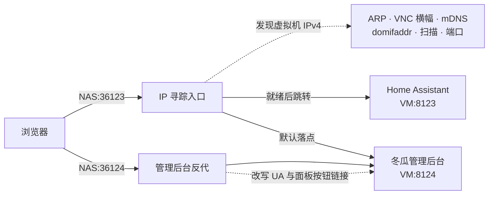

<p align="center">
  <br/>
</p>

<h1 align="center">冬瓜HAOS · for fnOS</h1>

<p align="center">
  在飞牛 NAS 上以虚拟机运行冬瓜HAOS，Home Assistant 开箱即用，装完只用一个入口访问
</p>

<p align="center">
  <a href="../../releases/latest"></a>
  
  
  <a href="LICENSE"></a>
</p>

<p align="center">
  <a href="../../releases/latest">下载 FPK</a> ·
  <a href="https://bbs.hassbian.com/thread-23791-1-1.html">冬瓜HAOS 镜像</a> ·
  <a href="https://www.home-assistant.io/">Home Assistant</a> ·
  <a href="https://github.com/Blue-Mink/fnos-vm-dongguaha/issues">反馈问题</a>
</p>

本仓库只负责 fnOS 侧的封装：向导收参数、下载冬瓜官方镜像、建 libvirt 虚拟机、提供固定入口与桌面图标，并在应用中心里正确响应启停。HAOS 与 Home Assistant 本体由上游发布，本仓库不做修改。

<p align="center">
  <br/>
  <sub>固定入口 <code>:36123</code> —— 已关机可一键开机 · 启动过程说清卡在哪 · 拿不到 IP 时经串口自救</sub>
</p>

## 安装

| 步骤 | 操作 |
| --- | --- |
| 1 | 从 [Releases](../../releases/latest) 下载 FPK（当前 `18.2.7`，SHA256 `d18f108c83a6b713a6aebeb121d8c86627728af6c441605cd27538ce173503d8`） |
| 2 | 应用中心 → 手动安装，向导里选 HAOS 版本 / CPU / 内存 / 磁盘 |
| 3 | 提交后立即返回，后台完成下载、校验与建机；全新安装约 3~6 分钟，磁盘已存在约 10~40 秒 |
| 4 | 打开 `http://<NAS 地址>:36123/`，虚拟机关着就点「启动虚拟机」 |

运行前提：fnOS x86_64、已安装飞牛「虚拟机」应用（`trim.vm`，需 `/dev/kvm`）、内存 ≥ 2 GB、安装卷剩余 ≥ 2 GB。

> [!NOTE]
> 安装进度：`cat /tmp/haos-install.state`（`starting → downloading → verifying → extracting → provisioning → resizing → defining-vm → entry-service → ready`），失败为 `failed:xxx`，日志见 `/tmp/haos-install.log`。中断后在应用中心点「启动」按原参数续跑。

> [!NOTE]
> 首次启动慢是正常现象：Supervisor 首启要从上游拉取运行镜像，Web 页面可能需要 **15~40 分钟**就绪，之后每次开机约 2~10 分钟。入口页会一路显示进度。

## 为什么这样设计

| 能力 | 说明 |
| --- | --- |
| 固定入口 | 应用中心与桌面图标恒定指向 `:36123`，自动跟随虚拟机地址变化 |
| 六级寻踪 | MAC/ARP → VNC 横幅 OCR → mDNS → domifaddr → 局域网扫描 → 端口探测 |
| 桌面双图标 | **冬瓜HAOS** 进管理后台，**Home Assistant** 进 `:8123`，各走各的门 |
| 状态透明 | 已关机 / 正在启动 / 还在获取地址 / Web 未就绪 / 已就绪，分开显示 |
| 跳转把关 | 目标必须真正应答 HTTP 才跳转，不把浏览器甩到空白页 |
| 反代优化 | 去掉管理后台的浏览器版本误报横幅，面板按钮自动指回虚拟机 |
| 串口自救 | 拿不到 IPv4 时经 libvirt 串口重试 DHCP、设静态地址或手动跳转 |
| 启停联动 | 停用即 ACPI 优雅关机；入口页开机也会把应用中心状态同步回来 |
| 数据不丢 | 换版本先留档旧盘，同版本原盘复用，重装沿用同一网卡 MAC |

## 工作原理



入口与反代由同一个 Python3 进程提供（`app/bin/haos-web-redirect.py`，systemd 单元 `dongguaha-web`），只用标准库，不额外装依赖。

## 默认端口

| 端口 | 位置 | 用途 |
| --- | --- | --- |
| `36123` | NAS | 主入口。就绪后跳管理后台；`/ha` 跳 Home Assistant；`/net` 是网络修复页 |
| `36124` | NAS | 管理后台反代（去横幅、面板按钮改写） |
| `8123` | 虚拟机 | Home Assistant Web UI |
| `8124` | 虚拟机 | 冬瓜管理后台，直连可用但没有反代优化 |
| `7681` | 虚拟机 | TTYD 终端 |

> [!WARNING]
> `/ha` 与后台面板里的「HA 登录页 / TTYD」按钮是**浏览器直连虚拟机 IP**。跨网段、VPN 之外或访客网络做 AP 隔离时会打不开；`36123` 与 `36124` 只要到得了 NAS 就正常。

## 支持的系统版本

镜像取自 [`fw.wghaos.com/haos/x86-64-vm/`](https://fw.wghaos.com/haos/x86-64-vm/)，按精确字节数、xz CRC、qcow2 魔数三重把关，不通过就整包重下（不做跨代理续传，避免拼出大小对内容错的混合文件）。

| 向导选项 | 大小 | 验证情况 |
| --- | --- | --- |
| 18.2（默认） | 904 MB | 真机全量：装机 → 建机 → 寻踪 → Web → 双入口 |
| 18.1 / 18.0 | 900 MB | 同一安装路径，仅核对过镜像地址与字节数 |
| 17.3.1 | 886 MB | 旁路实测：可引导、VNC 横幅可被 OCR 读出，后台伴侣为 WaxGourd v0.21.0 |

## 日常使用

> [!TIP]
> 向导里磁盘填 `0` 表示直通本机空闲整盘，HAOS 首次启动会自己把数据区扩满。

> [!WARNING]
> 点「停用」后应用中心立刻记为已停用，但虚拟机真正落定需要 **45~70 秒**（HAOS 逐个停核心、Supervisor 与插件容器），期间别急着再点启用。

## 卸载与数据

应用中心卸载只删除虚拟机定义与寻踪服务，**系统盘不会被删**。它位于 libvirt 存储池，重装即复用：

```
/vol1/vm/pool/haos.qcow2            当前系统盘（版本标记 /vol1/vm/haos.disk-version）
/vol1/vm/backup/haos.qcow2.swap-*   换版本时自动留档的旧盘
/vol1/vm/haos.vm-net                重沿用同一网卡 MAC 与 UUID 的记录
```

确认要彻底清除：

```bash
virsh vol-delete --pool vol1 haos.qcow2 && rm -f /vol1/vm/haos.disk-version
```

## 手机端

| 平台 | 下载 | 说明 |
| --- | --- | --- |
| Android (APK) | [下载 APK](https://github.com/Blue-Mink/fnos-vm-dongguaha/releases/download/v18.2/Home-Assistant.apk) | 本地安装包 |
| Android (Google Play) | [Google Play](https://play.google.com/store/apps/details?id=io.homeassistant.companion.android) | 官方商店 |
| iOS | [App Store](https://apps.apple.com/cn/app/home-assistant/id1099568401) | 官方商店 |

## 仓库结构

```
manifest                 应用元数据与服务端口
cmd/                     安装、卸载、配置、启停回调
app/bin/                 安装 worker、寻踪入口与反代、应用中心数据行守护
app/ui/                  桌面图标与入口配置
wizard/                  安装向导定义
docs/                    README 配图
```

## 从源码构建

```bash
fnpack build -d .        # 产出 com.dongguaha.vm.fpk，文件名补上版本号即可发布
```

`fnpack` 会把 `manifest.checksum` 自动重写成 `app.tgz` 的真实 MD5，无需手工计算。

## 许可与致谢

本仓库封装以 MIT 许可发布。Home Assistant 由社区维护，冬瓜HAOS 镜像与优化由[冬瓜HA](https://bbs.hassbian.com/thread-24065-1-1.html)提供，镜像本体版权归各自作者所有。
